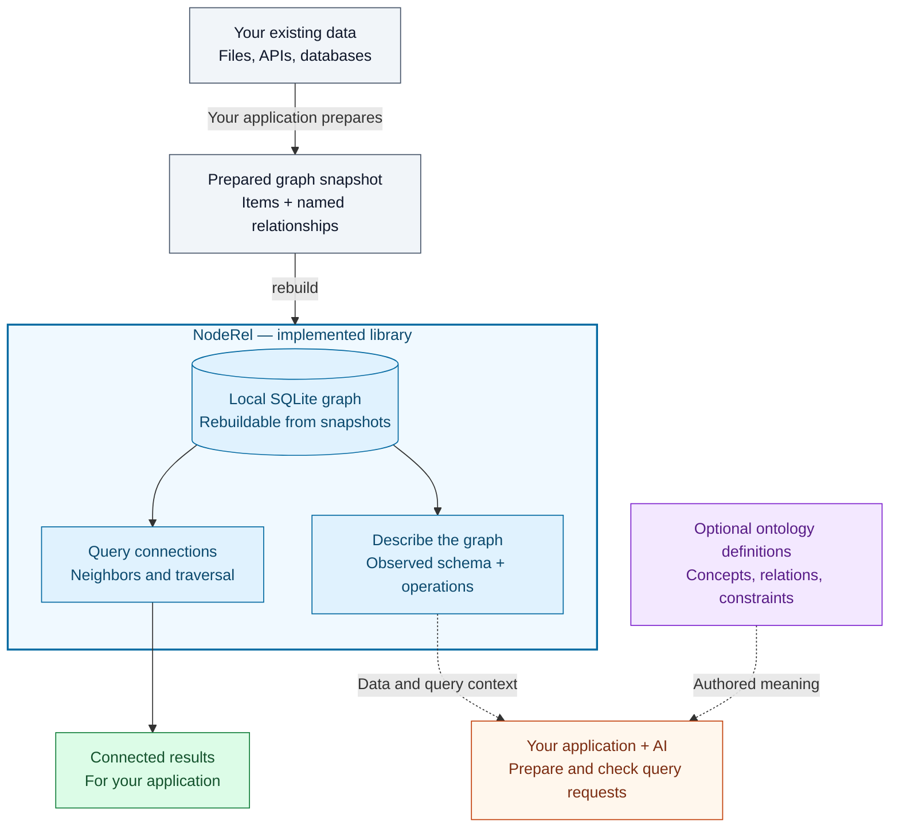
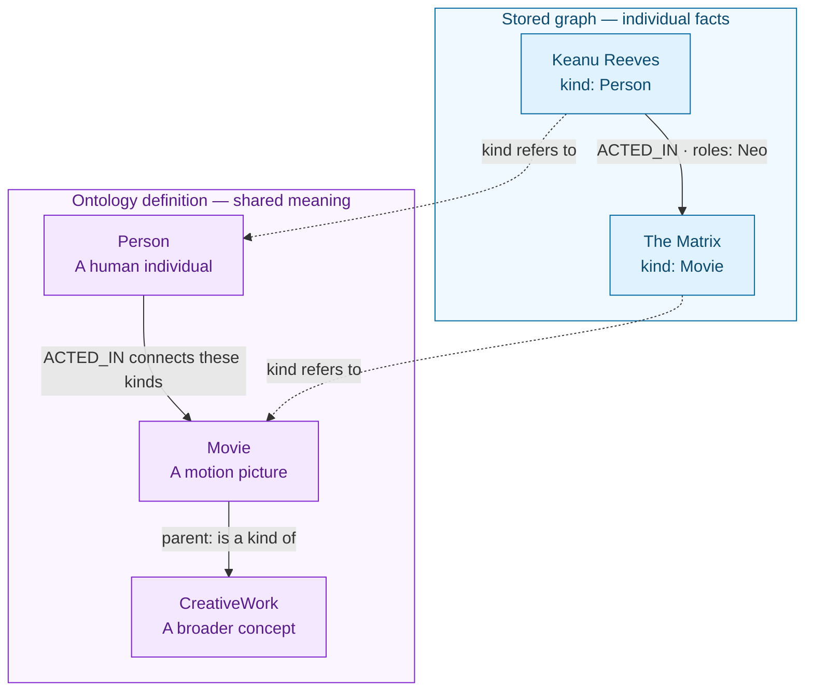
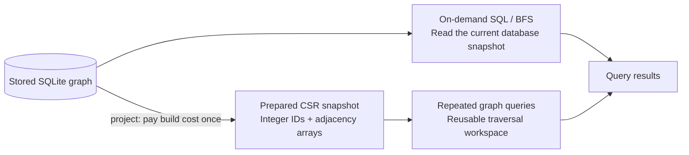

# NodeRel

**Understand your data by following its connections.**

NodeRel is a small software library that helps applications keep track of things and how they are related. It can find the films featuring an actor, the products connected to a customer's orders, or the tasks that depend on a requirement.

You provide the items and their connections. NodeRel stores them in a local database file and gives your application ways to follow those connections and ask questions. It can also describe the data to an AI application.

[Concept](#noderel-at-a-glance) · [Start here](#new-to-graphs-start-here) · [Visual guide](docs/visual-guide.md) · [Quick start](#quick-start) · [Query examples](#query-examples) · [Neo4j comparison](#noderel-and-neo4j) · [Benchmarks](#measured-performance) · [AI integration](#a-schema-for-ai-generated-queries) · [Ontology](#noderel-ontology-v1)

## NodeRel at a glance

**Keep your source data. Make its connections queryable. Give an AI application enough context to ask about them.**



The blue group is the implemented NodeRel library, running inside your application without a separate database server. Your application prepares the snapshot; `rebuild()` creates or replaces the derived graph. Queries return related data, while the schema exporter describes the stored data and supported operations.

**Dashed arrows show an optional application integration.** The developer supplies the AI model, name-to-ID resolution, request checks, and execution limits. Ontology files can be supplied as additional context; NodeRel does not automatically load them or enforce their constraints.

For example, “Which films feature Keanu Reeves?” becomes a request to start at his node and follow outgoing `ACTED_IN` relationships. The application can prepare that request directly or use an AI model to propose it. See the [query examples](#query-examples) and [AI integration flow](#a-schema-for-ai-generated-queries).

## New to graphs? Start here

### Start with one everyday fact

**Keanu Reeves acted in The Matrix.** You can represent that sentence as two things connected by a named arrow:


[View SVG](docs/assets/graph-basics.svg)

In this README, a **graph** is a map of connected things. Each box represents a thing, and each arrow explains a relationship between two things. Three words are enough to read the picture:

| Graph word | Everyday meaning | Example in the picture |
|---|---|---|
| **Node** | A thing you want to keep track of | The person Keanu Reeves or the movie The Matrix |
| **Relationship** (also called an **edge**) | A named connection between two things | Keanu Reeves `ACTED_IN` The Matrix |
| **Property** | A detail about a thing or a connection | The movie's title, or Keanu's role, Neo, in this particular film |

A person can appear in many movies and play a different role in each one. That is why the role belongs to the connection between the person and the movie. The arrow also gives the fact a direction: **person → acted in → movie**. These are the basic building blocks of the property graph model described in [Neo4j's introductory guide](https://neo4j.com/docs/getting-started/appendix/graphdb-concepts/).

### Follow the connections to answer a question

Add another fact: **Laurence Fishburne acted in The Matrix.** Now the two people share a connection through the same film.

| Question | How the graph helps |
|---|---|
| Which films feature Keanu Reeves? | Start at Keanu and follow his `ACTED_IN` arrows to films. |
| Who acted in The Matrix? | Start at the film and follow the incoming `ACTED_IN` arrows back to people. |
| Who has acted with Keanu Reeves? | Find his films, then find other people connected to those same films. |

Following connections is called **traversal**. Crossing one connection is one **hop**. Going from Keanu to The Matrix to Laurence takes two hops, with the second hop going against the stored arrow. NodeRel supports following outgoing arrows, incoming arrows, or both.

The two facts above are selected cast relationships from the included Movies dataset. That dataset contains more films and cast members. You can express the questions through NodeRel functions or SQL; the [query examples](#query-examples) show how.

### Graphs, graph databases, and knowledge graphs

These terms describe different parts of the idea:

| Term | Plain-language explanation |
|---|---|
| **Graph** | The connected information itself: things and their relationships. |
| **Graph database** | Software designed to store connected information and answer questions about it. Neo4j is one example. |
| **Knowledge graph** | A way to organize knowledge about real things or concepts using relationships with explicit meaning, such as a person acting in a film or a product belonging to a category. |
| **NodeRel** | This project's small library for storing and querying a graph using SQLite, a database engine that runs inside an application. |

A knowledge graph describes **what the information means**; a database provides **a way to store and query it**. The meaning comes from identifying the things and defining what their connections represent. See [Neo4j's explanation of knowledge graphs and graph databases](https://neo4j.com/blog/knowledge-graph/knowledge-graph-vs-graph-database/).

NodeRel can represent a small knowledge graph when you supply those things and meaningful relationships. For example, you can connect documents to the topics they mention or products to their categories. You define those connections; NodeRel does not automatically read arbitrary documents, discover facts, or decide what is true.

### An ontology gives the vocabulary a shared meaning

An **ontology** records the concepts your application uses and how they relate. The fact “Keanu Reeves acted in The Matrix” is data; the definitions “a movie is a kind of creative work” and “acting connects a person to a movie” are vocabulary knowledge.

**NodeRel Ontology v1** is this project's simplified JSON format for writing that vocabulary. It separates concept definitions, relationship meanings, and optional data checks. It is a custom format, with examples and a specification; the current query engine does not load or enforce it automatically. See the [ontology section](#noderel-ontology-v1) for its status and scope.

### What you can use NodeRel for

The same idea works beyond movies:

| Information you already have | Connections you could record | Questions your application could answer |
|---|---|---|
| Requirements and project tasks | A task implements a requirement; another task depends on it | Which tasks are connected to a requirement that changed? |
| Customers, orders, and products | A customer places an order; the order contains products | Which products and categories has this customer purchased? |
| Documents and topics | A document mentions a topic or refers to another document | Which documents are connected to this topic? |

The repository includes working movie and purchase examples, plus a small requirement/task example. A document graph would require your own data preparation. A list or spreadsheet can also store these facts; the graph representation makes their connections explicit and gives the application a consistent way to follow them.

### Where NodeRel fits in your application

A typical workflow has four steps:

1. **Keep your original data.** Files or existing systems remain the source you maintain.
2. **Describe the connections.** Prepare a list of items and a list of named relationships between them.
3. **Build a local graph file.** NodeRel stores those lists in SQLite so they can be queried together.
4. **Ask about related items.** Your application calls NodeRel to find neighbors, follow several connections, or find items missing a particular relationship.

We call the local graph a **derived index** because it is an extra representation made from your source data and can be rebuilt. The word **index** here means a structure that helps look things up. In NodeRel, it helps look up connections.

NodeRel is currently a developer toolkit. A developer prepares the data and connects the library to an application; you do not need to understand its code to understand the examples above. Its diagrams illustrate the concepts, and an interactive graph editor is not included.

For an AI interface, NodeRel can export a **schema**: a description of the kinds of items, the available relationships, and the supported queries. An AI application can use that description to propose a query for a user's question. The developer still supplies the AI model and checks the request before execution. A built-in chat assistant is not included.

Under the hood, this prototype uses Node.js and SQLite. It runs without a separate database server, and its core has no external npm dependencies. Neo4j is a dedicated graph database with a broader graph query interface; the [comparison](#noderel-and-neo4j) explains the differences, including workloads where Neo4j performed better.

Continue with the [quick start](#quick-start), or read the [first graph example](#your-first-graph) to see how a requirement connects to its tasks.

## Why NodeRel?

Many applications already have the data they need, but the connections are difficult to ask about:

- Which tasks depend on a requirement?
- Who worked with this actor?
- Which products did a customer buy, and which categories do they belong to?
- Which items are missing a required relationship?

NodeRel makes those connections explicit without first moving the entire application into a graph database. The derived graph can be rebuilt from your source data. SQLite's own table indexes help locate individual nodes and edges inside it.

The AI idea is simple: a user should be able to ask a question without learning a query language. An AI application can inspect node kinds, relationship directions, example IDs, and available operations, then produce a structured query request. NodeRel supplies that description and a small execution API. **The language model, entity resolution, and application integration are still supplied by the application developer.**

AI can also generate Cypher for Neo4j. NodeRel's distinction is its embedded storage and explicit, compact operation contract; AI does not remove differences in query expressiveness or execution performance.


[View SVG](docs/assets/architecture.svg)

The snapshot importer, SQLite queries, and schema exporter are implemented. Source adapters and the AI application are integration points; there is no automatic source watcher or natural-language service.

## Quick start

Use **Node.js 24.13.1 or later**. Run these commands from a source checkout; the package is not published on npm.

```sh
git clone https://github.com/tykimos/NodeRel.git
cd NodeRel
npm test
npm run demo:build
npm run demo -- show 1
npm run schema
```

| Command | What it does |
|---|---|
| `npm test` | Checks sample queries, SQL/BFS/CSR equivalence, shortest distances, snapshot lifecycle, the AI schema, and SQLite integrity. |
| `npm run demo:build` | Rebuilds `examples/neo4j/noderel.sqlite` from the committed snapshots. |
| `npm run demo -- show 1` | Shows the films featuring Keanu Reeves. |
| `npm run demo -- test` | Compares current SQLite results with the stored Neo4j baseline. |
| `npm run schema` | Exports the database description to `examples/ai/schema.json`. |

These commands do not require Neo4j or an npm dependency installation. Node 24.13.1 may print an experimental warning for `node:sqlite`.

## Your first graph


[View SVG](docs/assets/inbound-traversal.svg)

Run this JavaScript from the repository root, for example with `node --input-type=module`:

```js
import { NodeRel } from './src/noderel.mjs';

const graph = new NodeRel(':memory:');
try {
  graph.rebuild([{
    nodes: [
      { id: 'req:login', kind: 'Requirement', scope: 'app', title: 'User login' },
      { id: 'task:api', kind: 'Task', scope: 'app', title: 'Build login API' },
      { id: 'task:ui', kind: 'Task', scope: 'app', title: 'Build login screen' }
    ],
    edges: [
      { from: 'task:api', to: 'req:login', type: 'IMPLEMENTS', scope: 'app' },
      { from: 'task:ui', to: 'task:api', type: 'DEPENDS_ON', scope: 'app' }
    ]
  }]);

  const affected = graph.trace({
    id: 'req:login',
    scope: 'app',
    direction: 'in',
    maxDepth: 2,
    types: ['IMPLEMENTS', 'DEPENDS_ON']
  });
  console.log(affected.map(({ title, depth }) => ({ title, depth })));
  // [ { title: 'Build login API', depth: 1 },
  //   { title: 'Build login screen', depth: 2 } ]
} finally {
  graph.close();
}
```

`in` follows incoming relationships, so the query starts at the requirement and reaches the tasks pointing toward it. The `types` list allows either relationship type at every step; it does not enforce a different type at each depth.

## Query examples


[View SVG](docs/assets/example-graphs.svg)

The Movies panel shows two actual cast relationships. The Northwind panel shows a type-level pattern used by the query examples below.

### Which movies feature Keanu Reeves?

After `npm run demo:build`, run from the repository root:

```js
import { NodeRel } from './src/noderel.mjs';

const graph = new NodeRel('./examples/neo4j/noderel.sqlite', { readOnly: true });
try {
  const movies = graph.trace({
    id: 'movies:Person:Keanu%20Reeves',
    scope: 'movies',
    direction: 'out',
    maxDepth: 1,
    types: ['ACTED_IN']
  });
  console.log(movies.map(movie => movie.title));
} finally {
  graph.close();
}
```

The sample returns seven films, including *The Matrix*, *The Matrix Reloaded*, and *The Matrix Revolutions*. The full result is in the [verified tool-call example](examples/ai/example.json).

The equivalent question in the original Neo4j Movies model is:

```cypher
MATCH (:Person {name: $name})-[:ACTED_IN]->(movie:Movie)
RETURN movie.title AS title
ORDER BY title
```

Bind `$name` to `Keanu Reeves`. **NodeRel does not execute Cypher**; its public interface is JavaScript functions and SQLite SQL.

### Who has acted with Tom Hanks?

A typed two-step pattern can be expressed with parameterized SQL. Here, both relationships point from a person to a shared movie:

```sql
SELECT DISTINCT other.title AS name
FROM links AS acted
JOIN links AS shared ON shared.to_id = acted.to_id
JOIN items AS other ON other.id = shared.from_id
WHERE acted.from_id = :id
  AND acted.type = 'ACTED_IN'
  AND shared.type = 'ACTED_IN'
  AND acted.scope = :scope
  AND shared.scope = :scope
  AND other.scope = :scope
  AND other.id <> :id
ORDER BY name;
```

Bind `:id` to `movies:Person:Tom%20Hanks` and `:scope` to `movies`. This returns **34 distinct people** in the committed sample. Execute parameterized statements through `graph.db.prepare(sql).all({ id, scope })`.

The corresponding Cypher pattern is:

```cypher
MATCH (actor:Person {name: $name})-[:ACTED_IN]->(:Movie)<-[:ACTED_IN]-(other:Person)
WHERE other <> actor
RETURN DISTINCT other.name AS name
ORDER BY name
```

See the [query guide](docs/queries.md) for relationship properties, missing relationships, multi-hop traversal, shortest distance, and expected outputs. The repository contains [15 executable SQL/API–Cypher examples](examples/neo4j/cases.mjs).

## A schema for AI-generated queries


[View SVG](docs/assets/ai-query-sequence.svg)

This sequence shows how an application can integrate NodeRel. The model, resolver, and validation layer are application responsibilities; the schema exporter and graph operations are implemented here.

```js
import { describeNodeRel } from './src/describe.mjs';

const schema = describeNodeRel('./examples/neo4j/noderel.sqlite');
console.log(schema.scopes);
console.log(schema.existingOperations);
```

The exporter reads the actual database and describes:

- Node kinds, counts, example IDs, and populated node columns.
- Observed relationships such as `Person → ACTED_IN → Movie`.
- Relationship property names and JSON types, such as the `roles` array.
- Existing operations, including JSON Schema input contracts for `trace`, `traceStats`, `shortestDistance`, and `project`, plus separate contracts for prepared-projection queries.
- A source signature for identifying the imported snapshot.

An application can provide the relevant description to an AI model, resolve the user's entity to a real ID, and have the model propose a request like this:

```json
{
  "tool": "trace",
  "arguments": {
    "id": "movies:Person:Keanu%20Reeves",
    "scope": "movies",
    "direction": "out",
    "maxDepth": 1,
    "types": ["ACTED_IN"]
  }
}
```

The application validates the operation, scope, arguments, and execution budget, then calls `graph.trace(request.arguments)`. The repository verifies this request's result; it does **not** measure a model's ability to translate natural language.

Observed relationship shapes are descriptions of the snapshot, not enforced domain rules. Business meanings in the sample schema are curated. Generic name/alias resolution, complete request validation, time budgets, and an MCP/HTTP service are not implemented. See the [AI integration guide](examples/ai/README.md).

## NodeRel Ontology v1

**A small, authored vocabulary for the graph.** The draft format has three parts:

| Part | Purpose | Example |
|---|---|---|
| `concepts` | Define the kinds of things and an optional single-parent hierarchy | `Movie` is a kind of `CreativeWork`. |
| `relations` | Explain connections, expected endpoints, and relationship properties | `ACTED_IN` connects a `Person` to a `Movie`. |
| `constraints` | Specify optional data checks separately from meanings | `roles` must be a present array of strings. |

The distinction between a fact and its vocabulary is visible in one movie example:



The **Stored graph** group contains actual nodes and an edge; its role label abbreviates the stored `roles: ["Neo"]` property. The **Ontology definition** group defines what their kinds and relationship mean. Dashed arrows map each node's `kind` to its concept; they are not extra stored edges. `parent` classifies `Movie` under `CreativeWork` in the definition, without changing stored kinds or automatically expanding queries. The optional `constraints` section separately describes checks such as requiring `roles` to be an array of strings.

For example, the [complete Movies definition](ontologies/movies.json) includes these concept and relation definitions:

```json
{
  "concepts": {
    "Movie": {
      "description": "A motion picture represented in the dataset.",
      "parent": "CreativeWork"
    }
  },
  "relations": {
    "ACTED_IN": {
      "description": "A person performed in a movie.",
      "from": "Person",
      "to": "Movie",
      "reverseLabel": "has cast member"
    }
  }
}
```

This is an excerpt, not a complete ontology file. Complete files also declare the referenced concepts, scope, format identifier, profile ID, and version. `reverseLabel` is readable wording for the same relationship viewed backward; it does not create another edge type.

The ontology states **declared meaning**. The existing schema exporter reports **observed data**. Keeping them separate lets an application identify discrepancies and give an AI model both business context and actual storage facts.

**Current status:** the specification, JSON Schema, and Movies/Northwind examples are available. Loading these definitions into `describeNodeRel()`, enforcing them during import, and expanding queries through parent concepts are not implemented. Existing query behavior is unchanged.

The vocabulary is **NodeRel-specific** and makes no OWL, SHACL, or JSON-LD conformance claim. Its document structure is described by **JSON Schema Draft 2020-12**; that does not provide graph validation or reasoning by itself.

[Full specification](docs/ontology.md) · [Example files and structural validation](ontologies/README.md) · [Northwind definition](ontologies/northwind.json)

## NodeRel and Neo4j


[View SVG](docs/assets/execution-models.svg)

| Dimension | NodeRel today | Neo4j in this comparison |
|---|---|---|
| Deployment | SQLite inside a Node.js process; local file | A separate Community database server, queried over Bolt |
| Query interface | Small JavaScript API and SQL | Cypher graph patterns, paths, and aggregations |
| Data model | One `kind` per node; fixed node columns; JSON edge properties | Labeled nodes and typed relationships with properties |
| Graph traversal | Recursive SQL, on-demand BFS, or an explicitly prepared CSR snapshot | Graph operators chosen by the query planner; this comparison does not measure GDS |
| Shortest distance | `shortestDistance()` uses bidirectional BFS; optional SQL baseline | Expressed directly with `shortestPath` in the tested queries |
| AI integration | Actual schema and operation descriptions are exported | AI can generate Cypher using the application's schema/context |
| Concurrency tested | Independent SQLite read connections in worker threads | Independent Bolt sessions |
| Natural fit | Rebuildable local relationship views over existing data | Applications centered on varied graph queries and shared graph access |

Neo4j's advantage includes the ability to express graph work declaratively and let its execution planner choose graph operators. In the recorded plans, shortest-path and broad-reach queries use `ShortestPath` and `VarLengthExpand(Pruning,BFS,All)`. Building comparable specialized SQLite traversals required extra application code. See the [recorded plans](benchmarks/neo4j-strengths/query-plans.json) and [Neo4j shortest-path documentation](https://neo4j.com/docs/cypher-manual/25/patterns/shortest-paths/).

SQLite supports concurrent readers; it is not limited to one reader. Its embedded architecture and single-writer behavior serve different workloads from a database server. See [SQLite's guidance on suitable uses](https://www.sqlite.org/whentouse.html).

## Measured performance

### Prepared CSR optimization for repeated queries

The latest follow-up prepares a reusable in-memory graph with **`graph.project({ scope, types })`**. It uses the same official Paradise Papers data and 18 cases as the first experiment, and remeasures both the previous BFS and Neo4j in the same run. The SQLite graph remains the stored source; queries on the prepared object use a fixed snapshot.

The new implementation combines integer node IDs, compressed adjacency arrays (CSR), reusable queues and visited stamps, adaptive traversal, and bidirectional search that chooses the side with fewer edges to inspect. These changes remove repeated SQLite lookups and row conversion during projected queries. It does not cache query answers.




[View SVG](docs/assets/projection-latency.svg)

Median milliseconds, lower is better. **CSR numbers below exclude projection construction.** Reachability returns a count and sum of minimum depths; shortest distance returns one hop count.

| Workload | Previous NodeRel BFS | Prepared NodeRel CSR | Neo4j Bolt |
|---|---:|---:|---:|
| Reachability within 4 hops | 121.285 | **0.269** | 10.235 |
| Reachability within 6 hops | 717.884 | **1.793** | 53.228 |
| Reachability within 8 hops | 1,261.861 | **2.699** | 78.659 |
| Shortest distance: nearby pairs, 1–2 hops | 0.113 | **0.004** | 1.201 |
| Shortest distance: farther pairs, 5–8 hops | 23.799 | **0.089** | 2.488 |

Prepared reachability was **400–468× faster** than the previous on-demand BFS in this run. Most of the gain comes from the prepared representation and reusable workspace: plain CSR BFS was already much faster. The adaptive variant's medians were **1.12–1.38×** faster than plain CSR BFS in this run; the [report](benchmarks/paradise-papers/OPTIMIZATION.md#what-contributes-to-the-gain) includes that comparison.

**Preparation and freshness matter.** Building the 163,414-node projection took **435–725 ms** in three fresh processes with warm OS caches. It retains the 300,963 relationships of the three queried types. Observed retained JS heap growth was about **65.5 MiB**, with another **9.3 MiB** of array buffers; total process RSS after GC was about **345.6 MiB**, including SQLite/runtime overhead. An existing projection keeps its original data after writes or rebuilds. Create a replacement when fresh data is needed. A few tiny queries may not repay the build cost.


[View SVG](docs/assets/projection-concurrency.svg)

At eight clients, the finite-batch rates were **2,459.5 requests/s for prepared CSR** and **97.9 for Neo4j**. Each condition processes the same 360 requests, twice in reversed engine order. Projection creation and warmup are excluded; private projections multiply memory use per worker. This is not a sustained-capacity claim.

This comparison uses **Neo4j Cypher over Bolt**, not Neo4j's own GDS in-memory projections. Memory budgets are not equalized. The same 18 cases were used during development, and there is no held-out performance claim. The gains apply to repeated snapshot queries on data that fits in memory; they do not establish a universal database ranking.

```js
const projected = graph.project({ scope: 'movies', types: ['ACTED_IN'] });
try {
  const distance = projected.shortestDistance({
    id: 'movies:Person:Keanu%20Reeves',
    targetId: 'movies:Person:Tom%20Hanks',
    direction: 'both', maxDepth: 10
  }); // 4
} finally {
  projected.close();
}
```

[Full optimization report](benchmarks/paradise-papers/OPTIMIZATION.md) · [Reproduction](benchmarks/paradise-papers/README.md#run-the-prepared-projection-follow-up) · [Raw results](benchmarks/paradise-papers/optimization-results.json) · [Algorithm and lifecycle](docs/design.md#prepared-csr-projection)

### Official Paradise Papers dataset: SQL, optimized NodeRel, and Neo4j

The **first September 24, 2026 follow-up** uses the official [Neo4j ICIJ Paradise Papers example](https://github.com/neo4j-graph-examples/icij-paradise-papers). These earlier numbers exclude the prepared CSR feature above. Both databases contain **163,414 nodes and 311,925 normalized relationships**. The source has 364,456 relationships; identical same-type parallel connections were collapsed in both engines to match NodeRel's storage model. The tested reachability and minimum distances are preserved by this normalization.

This experiment measures the **actual public NodeRel APIs** using either the existing recursive SQL or newly added algorithms:

- **Batched BFS** visits each reached node once and reads SQLite adjacency in batches of 256 frontier IDs.
- **Bidirectional BFS** searches from both endpoints for shortest distance, expanding the smaller frontier and stopping when the searches meet.
- Both reuse prepared statements and read SQLite on demand, without a full graph preload or cached answers.


[View SVG](docs/assets/paradise-latency.svg)

Median milliseconds; lower is better. Reachability returns a count and sum of minimum depths. Shortest-distance groups use their independently verified connection lengths.

| Workload | NodeRel SQL | Optimized NodeRel | Neo4j Bolt |
|---|---:|---:|---:|
| Reachability within 4 hops | 812.638 | 142.852 | **12.994** |
| Reachability within 6 hops | 1,595.371 | 767.689 | **58.437** |
| Reachability within 8 hops | 3,108.640 | 1,266.693 | **70.341** |
| Shortest distance: nearby pairs, 1–2 hops | 4,419.958 | **0.131** | 2.003 |
| Shortest distance: farther pairs, 5–8 hops | 4,114.821 | 21.095 | **3.580** |

NodeRel's BFS reduced reachability latency by **2.1–5.7×** versus its SQL baseline. Even after that optimization, Neo4j was **11–18× faster** for these broad traversals. The graph's hubs lead to large neighborhoods within a few steps. Nearby shortest-distance queries favored embedded NodeRel, while the farther pairs favored Neo4j. A single mixed shortest-distance median would hide that distinction.


[View SVG](docs/assets/paradise-concurrency.svg)

Each concurrent condition processes the **same 36 requests**, twice per sampled source. The two rounds reverse engine order. NodeRel uses one worker and SQLite reader per client; Neo4j uses independent Bolt sessions. These finite batches measure this workload, **not sustained service capacity**. The [report](benchmarks/paradise-papers/REPORT.md#concurrent-six-hop-traversal) includes rates and run-to-run ranges.

For the single-request results, six sources from each of three degree groups were selected before timing; each reachability cell has 36 observations. The nearby/farther distance groups have 12/22 observations. One unreachable pair remains in the report and raw data. Three relationship types are followed in both directions. All normalized nodes and edges were checked for equality, every aggregate was checked against independent BFS, and full returned records were compared and timed separately.

Both engines ran on an Apple M3 with 24 GiB RAM, using warm caches, Neo4j Community 2025.06.2, Node 25.6.0, and SQLite 3.53.4. Neo4j includes local Bolt overhead; memory budgets are not equalized. This is one read-only dataset and a stratified sample, not a general database ranking. The earlier experiment below used a different Node/SQLite version and dataset; compare implementations within each experiment.

Use the optimized API after importing the dataset:

```js
graph.traceStats({
  id: sourceId,
  scope: 'paradise',
  direction: 'both',
  maxDepth: 6,
  types: ['OFFICER_OF', 'INTERMEDIARY_OF', 'REGISTERED_ADDRESS'],
  algorithm: 'bfs'
});
```

[Full report and query plans](benchmarks/paradise-papers/REPORT.md) · [Reproduction](benchmarks/paradise-papers/README.md) · [Raw results](benchmarks/paradise-papers/results.json) · [Dataset provenance](benchmarks/paradise-papers/sources.json)

### Earlier synthetic dataset

The following charts preserve the **September 23, 2026 experiment**. Its graph has **50,000 nodes and 300,000 directed edges**. Three implementations are kept separate:

1. **SQLite recursive SQL:** the bounded `(id, depth)` CTE approach adapted for benchmark outputs. This is related to the public `trace()` implementation, but the measurements are not direct timings of that API.
2. **SQLite + custom BFS:** the earlier, separate benchmark implementation of breadth-first and bidirectional search. It queries SQLite indexes as it explores. These historical measurements predate the new optional BFS API and do not measure that API. Single-node lookup uses direct SQL.
3. **Neo4j over Bolt:** Cypher executed through a reused local driver/session, including transport and result handling.

#### Query latency


[View SVG](docs/assets/query-latency.svg)

Median milliseconds; lower is better. A dash means that separate implementation was not measured.

| Workload | SQLite recursive SQL | SQLite + custom BFS* | Neo4j Bolt |
|---|---:|---:|---:|
| Single node lookup | — | 0.006 | 0.276 |
| Shortest distance, up to 10 hops | 1,709.006 | 1.530 | 1.919 |
| Shortest distance avoiding inactive nodes | 1,291.534 | 1.903 | 1.984 |
| Reachability within 3 hops | 0.535 | 0.194 | 1.043 |
| Reachability within 6 hops | 98.085 | 25.846 | 13.592 |

\* Benchmark-only traversal code; point lookup is direct SQL. Reachability returns a count and the sum of minimum depths, rather than every reached node.

Neo4j was about **1.9× faster than custom SQLite BFS** on six-hop reachability, which reached roughly 32,000 nodes per source. SQLite had lower latency for small local reads. The large shortest-distance gap against the CTE reflects different algorithms: the CTE explores the bounded reachable graph, whereas bidirectional BFS can stop early. It is not evidence of a universal database-engine speed ratio.

#### Concurrent traversal


[View SVG](docs/assets/concurrent-throughput.svg)

Completed requests per second; higher is better. Each client sends its next request after the previous one finishes.

| Run | Clients | SQLite + custom BFS | Neo4j Bolt | Neo4j / SQLite |
|---|---:|---:|---:|---:|
| Primary | 1 | 35.4 | 80.8 | 2.28× |
| Primary | 4 | 78.0 | 188.2 | 2.41× |
| Primary | 8 | 67.4 | 225.5 | 3.34× |
| Reversed-order repeat | 8 | 105.0 | 325.9 | 3.10× |

Neo4j delivered **3.1–3.3× the throughput** at eight concurrent clients in these short runs. Absolute rates changed in the repeat, so the results do not establish sustained production capacity.

#### How to read the earlier numbers

- **Hardware/software:** Apple M3, 24 GiB RAM, Node 24.13.1, SQLite 3.51.2, Neo4j Community 2025.06.2, driver 5.28.3.
- **Warm cache, local machine:** SQLite runs in process; Neo4j includes a local Bolt round trip. These are client-observed timings, not isolated engine timings. Startup and import are excluded.
- **Memory:** Neo4j uses a 1 GiB heap plus 1 GiB page cache; SQLite allows 64 MiB cache per connection for an approximately 43 MiB file. Memory budgets were not equalized.
- **Samples:** 120 point lookups, 12 pairs for each shortest-distance workload, and 24 sources for each reachability workload. Concurrent conditions ran for approximately six seconds each.
- **Correctness:** 7,529 result checks across the primary run and repeat, using fixed expected values for simple reads and an independent in-memory BFS for graph searches. Complete node/depth sets were also compared for three sources. Reference computation is excluded from timings.
- **Scope:** one synthetic graph, read-only workloads, no cold-cache, concurrent-write, high-availability, or GDS evaluation. Graph shape and query design matter as much as hop count.

The [full benchmark report](benchmarks/neo4j-strengths/REPORT.md) includes p95 latency, methodology, Cypher, interpretation, and limitations. Use the [reproduction instructions](benchmarks/neo4j-strengths/README.md) and [raw results](benchmarks/neo4j-strengths/results.json) to inspect or rerun the experiment.

## API at a glance

| API | Result / purpose |
|---|---|
| `new NodeRel(file, { readOnly })` | Opens a file or `:memory:` database. Writable mode initializes the tables. |
| `rebuild(snapshots)` | Replaces the index transactionally; returns node/edge counts and rejected edges. |
| `trace({ id, scope, direction, maxDepth, types, algorithm })` | Returns unique reached nodes with `id`, `title`, `kind`, and minimum `depth`; `algorithm` is `sql` (default) or `bfs`. |
| `traceStats(options)` | Returns `{ count, depthSum }` for the same traversal; supports both algorithms without returning full node records. |
| `shortestDistance({ id, targetId, scope, direction, maxDepth, types, algorithm })` | Returns a bounded minimum hop count or `null`; defaults to bidirectional `bfs`, with an optional `sql` baseline. |
| `project({ scope, types })` | Builds a fixed in-memory CSR snapshot with `trace`, `traceStats`, `shortestDistance`, `info`, and `close`; pays a one-time build/memory cost. |
| `traceQuery(options)` | Returns the generated SQL and bound parameters without executing it. |
| `neighbors(id, scope)` | Returns incident incoming/outgoing edges with parsed JSON properties. |
| `orphans({ scope, kind, type, side })` | Finds nodes without a specified incoming or outgoing relationship. |
| `stats(scope)` | Counts node kinds and relationship types. |
| `graph(scope)` | Returns all stored nodes and edges in a scope; edge `attrs` remains JSON text. |
| `close()` | Closes the SQLite connection. |
| `describeNodeRel(file)` | Exports schema observations and operation descriptions from a read-only connection. |

`trace()` defaults to `direction: 'out'`, `maxDepth: 10`, and all relationship types. Directions are `out`, `in`, or `both`; depth must be an integer from 0 to 10. The start node is excluded. Results contain minimum hop counts, **not complete paths**. A missing or out-of-scope start returns no reached nodes.

Choose `algorithm: 'bfs'` to avoid revisiting nodes at different depths. It fetches adjacency from SQLite in batches, without preloading the graph or caching answers. `shortestDistance()` expands from both endpoints and can stop when the searches meet; an existing source equal to its target has distance zero. Multi-statement BFS queries use a consistent read transaction and preserve transactions opened by the caller. See the [algorithm design](docs/design.md#optional-bfs-and-bidirectional-search).

For repeated queries, create a projection with `project({ scope, types })`. Its methods accept IDs, direction, and depth; scope/types are fixed at creation. Projected `trace`/`traceStats` accept `algorithm: 'adaptive'` (default) or `'bfs'` for top-down CSR search. Projected shortest distance chooses which side to expand by its frontier edge count. The projection remains its original snapshot after database changes or closure; replace it explicitly to refresh, and call `projected.close()` to release it. See [projection semantics](docs/design.md#prepared-csr-projection).

## Storage and current boundaries


[View SVG](docs/assets/storage-model.svg)

The connectors show logical references checked during import. They are not SQL foreign-key constraints.

| Table | Contents |
|---|---|
| `items` | `id`, `kind`, `scope`, `no`, `title`, `status`, `updated_at` |
| `links` | `from_id`, `to_id`, `type`, `scope`, JSON `attrs` |
| `sync_meta` | Snapshot SHA-256, rebuild timestamp, rejected edges |

A rebuild requires globally unique node IDs and at most one edge for each `(from, to, type)` tuple. It rejects cross-scope edges with an error, records self-links and missing-endpoint edges as excluded, and rolls back if writing fails. Different relationship types between the same endpoints are supported.

The index does not store every original node property: birth dates, release years, and product prices remain in the sample snapshots. Multiple node labels and same-type parallel relationships require a model extension. Synchronization is manual. `scope` filtering does not implement authentication or authorization, and the raw `.db` handle has no application policy layer.

`DatabaseSync` blocks its calling thread. Depth limits also do not guarantee a small amount of work: a shallow, highly connected graph may be expensive. Worker placement, execution budgets, and service-level controls belong in the integrating application. See [design and semantics](docs/design.md).

## Example coverage

| Official dataset | Nodes | Relationships |
|---|---:|---:|
| Movies | 171 | 253 |
| Northwind | 1,035 | 3,139 |
| **Total** | **1,206** | **3,392** |

Fifteen queries cover one-hop lookups, co-actors, relationship properties, joins, aggregation, missing relationships, reachability, and minimum distance. Current tests compare SQLite output with results previously recorded from Neo4j; **they do not query a live Neo4j server**. The earlier small-sample timings used HTTP and are kept separate from the Bolt charts above.

[Sample instructions](examples/neo4j/README.md) · [Correctness report](examples/neo4j/REPORT.md) · [Data sources and checksums](examples/neo4j/sources.json)

## Repository map

```text
src/                         Core graph API and schema exporter
examples/neo4j/               Snapshots, runnable queries, stored reference results
examples/ai/                  AI-readable schema and verified request example
ontologies/                   Custom ontology specification schema and examples
benchmarks/neo4j-strengths/   Synthetic dataset benchmark and recorded measurements
benchmarks/paradise-papers/   Official dataset, public API comparison, and reproduction
docs/                        Query guide, design notes, charts, and diagrams
scripts/                     Tests and reproducible visual renderers
```

All chart and diagram labels use English. PNG images are embedded directly in the documentation, with matching SVG files for scaling and editing. The [visual guide](docs/visual-guide.md) lists every asset and explains the diagram conventions.

To regenerate the charts from recorded measurements and rebuild the diagrams, install the optional Python plotting dependency in a virtual environment:

```sh
python3 -m venv /tmp/noderel-charts
/tmp/noderel-charts/bin/python -m pip install -r scripts/requirements-charts.txt
/tmp/noderel-charts/bin/python scripts/render-benchmarks.py
/tmp/noderel-charts/bin/python scripts/render-paradise.py
/tmp/noderel-charts/bin/python scripts/render-optimization.py
/tmp/noderel-charts/bin/python scripts/render-diagrams.py
```

These commands redraw the visuals; they do not rerun the database benchmarks. Python and Matplotlib are not required to use NodeRel itself.

## License and attribution

This repository is a prototype with **no open-source license granted for its own code** (`UNLICENSED` in `package.json`). The official example datasets retain their respective terms. See [third-party notices](THIRD_PARTY_NOTICES.md).
