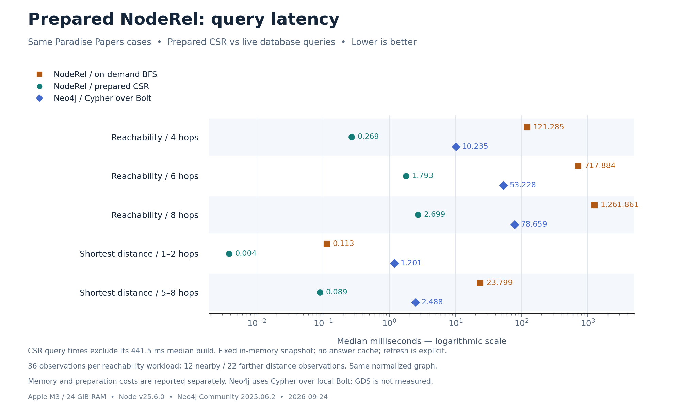
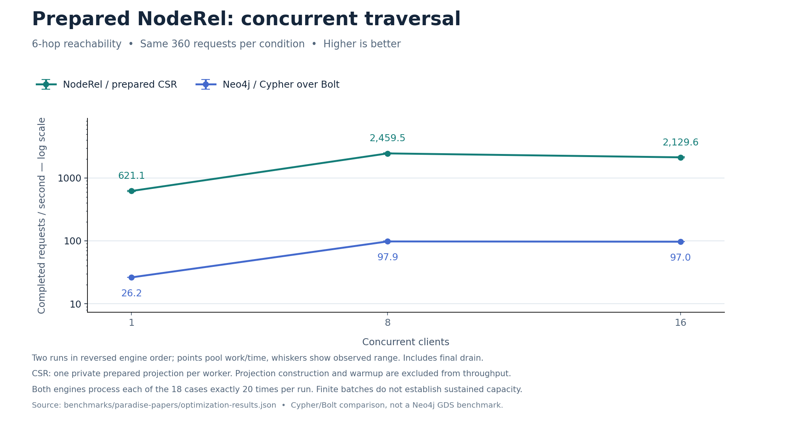

# Prepared CSR optimization on Paradise Papers

Recorded 2026-09-24. [Raw results](optimization-results.json) · [Reproduction](README.md#run-the-prepared-projection-follow-up) · [Earlier on-demand experiment](REPORT.md).

## Result and boundary

On the same 18 Paradise Papers cases, prepared NodeRel CSR reduced 4/6/8-hop median query latency by **451× / 400× / 468×** against freshly measured on-demand NodeRel BFS. These gains include a change of representation and execution boundary: adjacency is compiled into memory before querying.

Projection construction took **435.3–724.6 ms** in three fresh processes (median **441.5 ms**, warm OS caches). The latency chart excludes that cost. This is a reusable fixed snapshot, not a faster live SQLite query or a cached answer. Writes require creating a replacement projection.

Neo4j was remeasured with the same Cypher/Bolt queries and graph as the first experiment. This is not an equal-memory, engine-only comparison and does not measure Neo4j GDS. Neo4j also offers [in-memory graph projections through GDS](https://neo4j.com/docs/graph-data-science/current/management-ops/graph-creation/graph-project/); its projected algorithms could change the comparison.

## Query latency



[View SVG](../../docs/assets/projection-latency.svg)

Median milliseconds, lower is better. Medians use the upper middle observation for even sample counts, matching the recorder. Each reachability cell has 36 observations; nearby/farther shortest-distance groups have 12/22.

| Workload | On-demand NodeRel BFS | Prepared CSR | Neo4j Bolt | BFS / CSR |
|---|---:|---:|---:|---:|
| Reachability / 4 hops | 121.285 | 0.269 | 10.235 | 450.5× |
| Reachability / 6 hops | 717.884 | 1.793 | 53.228 | 400.5× |
| Reachability / 8 hops | 1,261.861 | 2.699 | 78.659 | 467.5× |
| Shortest distance / 1–2 hops | 0.113 | 0.004 | 1.201 | 29.8× |
| Shortest distance / 5–8 hops | 23.799 | 0.089 | 2.488 | 267.0× |

One pair has no connection within ten hops; its two observations remain in the raw data. Nearby and farther groups are defined by independently verified distance, not timing. Reachability returns distinct reached-node count and sum of minimum depths, excluding the source; shortest distance returns a hop count or null.

### What contributes to the gain?

CSR replaces repeated SQLite adjacency reads, string hashing, node-scope joins, and row conversion during traversal with dense integer indices and contiguous typed arrays. Epoch stamps and reusable queues reduce per-query initialization/allocation. Bidirectional shortest distance expands the side with fewer incident edges instead of fewer nodes. These changes are measured as a package; their individual causal contributions are not isolated.

The ablation below keeps the CSR representation and workspace identical, then compares ordinary top-down BFS with the adaptive traversal. Most of the gain comes before the adaptive step. The latter can switch to checking unvisited nodes for a predecessor in the current frontier, using a conservative work estimate; it is not guaranteed to win on every graph.

| Reachability | CSR top-down BFS ms | CSR adaptive ms | Top-down / adaptive |
|---|---:|---:|---:|
| Reachability / 4 hops | 0.371 | 0.269 | 1.38× |
| Reachability / 6 hops | 2.203 | 1.793 | 1.23× |
| Reachability / 8 hops | 3.020 | 2.699 | 1.12× |

See [algorithm design](../../docs/design.md#prepared-csr-projection) and [the direction-optimizing BFS paper](https://people.eecs.berkeley.edu/~krste/papers/beamer-sc2012.pdf). This synchronous implementation uses its own switching estimate, not the paper's parallel code or speedup claims.

## Preparation, memory, and amortization

The original normalized store has 163,414 nodes and 311,925 relationships. The projection retains all nodes in the scope and the **300,963 relationships** of the three queried types. Neo4j/on-demand BFS filter those same types during querying. Both directions are supported. Source topology and current store hashes match the first experiment.

| Fresh process | Build ms | First six-hop query ms | Retained JS heap growth MiB | Retained array-buffer growth MiB | Process RSS after GC MiB |
|---:|---:|---:|---:|---:|---:|
| 1 | 724.605 | 8.044 | 65.47 | 9.27 | 345.59 |
| 2 | 441.462 | 4.998 | 65.47 | 9.27 | 345.69 |
| 3 | 435.260 | 4.800 | 65.47 | 9.24 | 345.55 |

Exact retained typed-array capacity is **6.46 MiB adjacency + 2.81 MiB workspace**. This is not total projection memory: node records, strings, and the ID map live on the JS heap. RSS additionally includes SQLite page caches, runtime pages, and allocator overhead; it is a whole-process observation, not bytes owned only by the projection. Peak RSS and pre/post-build snapshots are preserved in raw results.

Fresh process does not mean cold storage: no OS cache flush was performed. The first query is measured before traversal warmup and returns case 0; later ready-query timings use all cases. The source signature is metadata from the last SQLite rebuild, not an automatic invalidation mechanism for raw writes.

The following rough amortization estimates divide median build time by the **mean per-query saving** over the measured case mixture. They assume repeated queries on the same projection and round up to whole queries. They are not latency guarantees for a particular starting node.

| Workload | Queries to amortize build versus on-demand BFS |
|---|---:|
| Reachability / 4 hops | 3 |
| Reachability / 6 hops | 1 |
| Reachability / 8 hops | 1 |
| Shortest distance / 1–2 hops | 5110 |
| Shortest distance / 5–8 hops | 17 |

## Full records and result transfer

Separate six-hop runs return the same sorted `id`, `title`, `kind`, and `depth` records. Values below are arithmetic means of two observations, including row materialization and Neo4j Bolt result transfer. They do not establish tail latency.

| Case | Returned rows | On-demand BFS ms | Prepared CSR ms | Neo4j ms |
|---:|---:|---:|---:|---:|
| 0 | 105,504 | 872.555 | 145.183 | 465.081 |
| 6 | 110,344 | 909.949 | 135.510 | 285.598 |
| 12 | 148,383 | 1,589.928 | 185.424 | 430.514 |

## Concurrent six-hop traversal



[View SVG](../../docs/assets/projection-concurrency.svg)

Exactly 360 requests per condition, 20 per case, in two runs reversing engine order. Throughput pools completed work over elapsed time; ranges show the two runs, not confidence intervals. Each CSR worker owns a private projection and closes its SQLite connection after building it.

| Clients | CSR requests/s (range) | Neo4j requests/s (range) | CSR / Neo4j |
|---:|---:|---:|---:|
| 1 | 621.1 (605.6–637.4) | 26.2 (26.2–26.3) | 23.7× |
| 8 | 2,459.5 (2,424.0–2,496.0) | 97.9 (96.2–99.7) | 25.1× |
| 16 | 2,129.6 (2,083.9–2,177.5) | 97.0 (96.6–97.3) | 22.0× |

Worker creation, projection construction, and warmup are excluded from throughput; per-condition setup time and each worker's build time are retained in the raw file. Private projections multiply memory use with client count. Worker message overhead and draining the last requests are included. This finite-batch test does not establish sustained production capacity, and these 360-request rates should not be directly combined with the earlier 36-request experiment.

## Usage

```js
const projected = graph.project({
  scope: 'paradise',
  types: ['OFFICER_OF', 'INTERMEDIARY_OF', 'REGISTERED_ADDRESS']
});
try {
  const summary = projected.traceStats({ id: sourceId, direction: 'both', maxDepth: 6 });
  const distance = projected.shortestDistance({ id: sourceId, targetId, direction: 'both', maxDepth: 10 });
  console.log(summary, distance, projected.info);
} finally {
  projected.close();
}
```

Scope/types belong to projection creation. Query methods reject those options rather than silently applying a different scope. A projection is immutable data plus reusable private query workspace. It remains valid as its original snapshot after SQLite changes or closes; explicitly create a replacement when fresh data is required.

## Verification and limits

All original node records and normalized edge identities matched between the two current stores and the independently verified earlier hashes. There were **5,868 aggregate checks**, including warmups/concurrency. Full-row outputs for three cases matched independent result hashes for every implementation and again during timed full-row calls. Core tests add 3,750 projection/BFS comparisons on a different seeded directed graph, plus Unicode ordering, malformed endpoints, missing scopes, rebuilds, multiple connections, ownership and closed-projection behavior. Existing SQL/BFS/reference tests remain in place.

Environment: Apple M3, 8 logical CPUs, 24 GiB RAM, Node v25.6.0, SQLite 3.53.4, Neo4j Community 2025.06.2. Neo4j heap/page cache are 1 GiB each; SQLite allows 64 MiB per open connection. Memory budgets are not equalized.

The same fixed 18 performance cases were used during development; there is no held-out performance claim. Timings are warm-cache desktop samples. There are no concurrent writes, cold-cache measurements, weighted paths, complete path enumeration, GDS comparison, or production latency guarantees. The main gain is applicable to repeated queries on a graph that fits in memory and can be queried as an explicit snapshot.
