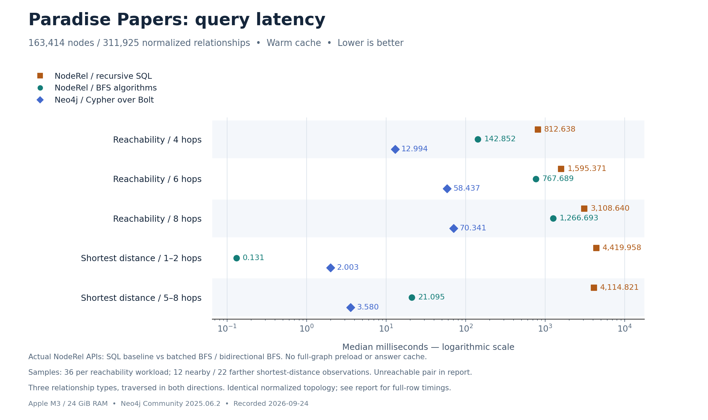
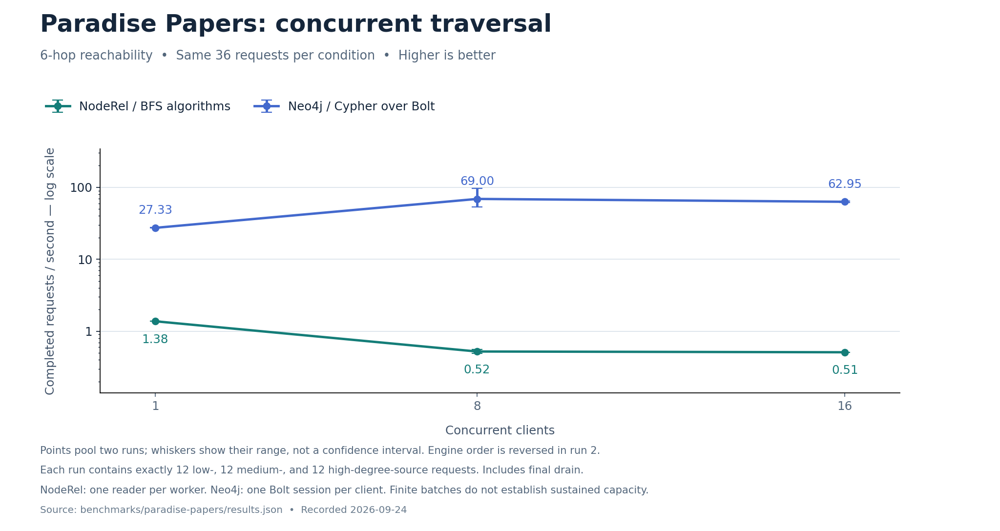

# Paradise Papers: NodeRel algorithms and Neo4j

Recorded 2026-09-24. Apple M3, 24 GiB RAM, both engines on the same computer. [Reproduction](README.md) · [Raw measurements](results.json) · [Cases](cases.json) · [Source provenance](sources.json).

A subsequent [prepared CSR optimization](OPTIMIZATION.md) measures a separate in-memory snapshot API, including build and memory costs. The on-demand measurements below are preserved unchanged.

## Findings

Neo4j was **11.0× / 13.1× / 18.0× faster** in median client latency for 4/6/8-hop scalar reachability than the optimized NodeRel BFS API. This dataset exposes broad, hub-connected neighborhoods. This is a workload-specific result, not a universal database ranking.

Shortest distance depends on the endpoints: for the six nearby pairs (1–2 hops), NodeRel bidirectional BFS measured **0.131 ms** versus **2.003 ms** for Neo4j. For the eleven farther pairs (5–8 hops), the respective medians were **21.095 ms** and **3.580 ms**, favoring Neo4j. One pair had no connection within ten hops. The large SQL/BFS gap is primarily an algorithm comparison.

The optimized algorithms are now optional public NodeRel APIs, not a benchmark-only replacement. They read SQLite adjacency on demand, maintain request-local visited maps, and do not preload the graph or cache answers. The previous synthetic experiment remains separately published.

## Data and equal work

The pinned official Neo4j example contains **163,414 nodes and 364,456 relationships**. Both measured stores use the same normalized projection: **163,414 nodes and 311,925 relationships**, after collapsing **52,531 duplicate `(from, to, type)` tuples**. No self-loops were found. This preserves reached-node sets and minimum hop counts for distinct endpoints; it does not preserve multigraph multiplicity or every property variant.

The queries use the official guide's `OFFICER_OF`, `INTERMEDIARY_OF`, and `REGISTERED_ADDRESS` types in both directions: **300,963** normalized relationships. Original kinds and display values are equal in both databases. Neo4j has a common `Paradise` label and a unique ID constraint; neither engine receives a precomputed reachability index. Additional source properties are not part of these queries.

There are 59,102 degree-one nodes, 77,042 nodes of degree 2–4, and 24,859 nodes of degree at least 5; 2,411 isolated nodes are excluded from source sampling. Degree counts distinct neighbors over the selected types. Six sources per group are selected using a fixed seed before measuring. This gives each group equal representation, not the weight it has in the full population. Near, far, and random targets are predefined in `cases.json`.

ICIJ records do not imply wrongdoing. No identity resolution or allegations about individuals are made by this benchmark.

## Single-request latency



[View SVG](../../docs/assets/paradise-latency.svg)

Median milliseconds; lower is better. Each cell contains 36 observations: two rounds across the same 18 cases. The recorder uses the upper middle observation for even-sized samples; all tables and figures use that same convention.

| Workload | NodeRel SQL | NodeRel BFS algorithms | Neo4j Bolt |
|---|---:|---:|---:|
| Reachability / 4 hops | 812.638 | 142.852 | 12.994 |
| Reachability / 6 hops | 1,595.371 | 767.689 | 58.437 |
| Reachability / 8 hops | 3,108.640 | 1,266.693 | 70.341 |
| Shortest distance / up to 10 hops | 4,063.414 | 0.979 | 2.086 |

Reachability returns **only the number of distinct reached nodes and the sum of their minimum depths**, excluding the source. It does not send all nodes over Bolt or enumerate paths. Shortest distance returns one bounded distance or null. The SQL and BFS measurements call `traceStats()` and `shortestDistance()` directly.

### Shortest distance by actual connection length

The mixed-target median above depends on the case mixture and hides an important difference. These groups are based on independently verified distance, not measured speed. All pairs remain in the raw data and overall table.

| Pair group | Observations | NodeRel SQL ms | NodeRel BFS ms | Neo4j ms |
|---|---:|---:|---:|---:|
| 1–2 hops | 12 | 4,419.958 | 0.131 | 2.003 |
| 5–8 hops | 22 | 4,114.821 | 21.095 | 3.580 |
| No connection within 10 hops | 2 | 597.530 | 0.121 | 2.062 |

The unreachable group contains only one pair repeated twice and cannot establish general no-path performance. The chart emphasizes the two connected groups rather than combining their different workloads.

### Source-degree groups

| Workload | Source group | NodeRel SQL ms | NodeRel BFS ms | Neo4j ms |
|---|---|---:|---:|---:|
| Reachability / 4 hops | low | 681.164 | 18.738 | 4.473 |
| Reachability / 4 hops | medium | 929.447 | 274.940 | 20.030 |
| Reachability / 4 hops | high | 1,425.064 | 699.736 | 49.833 |
| Reachability / 6 hops | low | 1,301.756 | 595.874 | 36.619 |
| Reachability / 6 hops | medium | 1,953.382 | 908.254 | 55.630 |
| Reachability / 6 hops | high | 2,861.904 | 1,199.154 | 72.579 |
| Reachability / 8 hops | low | 2,739.401 | 1,121.284 | 67.377 |
| Reachability / 8 hops | medium | 3,541.769 | 1,284.685 | 66.245 |
| Reachability / 8 hops | high | 4,523.942 | 1,278.935 | 78.440 |
| Shortest distance / up to 10 hops | low | 3,728.930 | 0.589 | 2.062 |
| Shortest distance / up to 10 hops | medium | 4,419.958 | 18.195 | 3.192 |
| Shortest distance / up to 10 hops | high | 5,224.454 | 0.979 | 2.185 |

Each degree-group cell contains 12 observations. A low-degree start can reach a large hub a few steps later; starting degree alone is not the amount of traversal work.

### Full node records and result transfer

The following separate measurements return identical sorted `id`, `title`, `kind`, and `depth` records for six-hop traversal. They include materializing those records and, for Neo4j, transferring them over Bolt. Each cell is the arithmetic mean of two observations; these are supplementary timings, not stable tail estimates.

| Case / source degree | Returned rows | NodeRel SQL ms | NodeRel BFS ms | Neo4j ms |
|---|---:|---:|---:|---:|
| 0 / 1 | 105,504 | 1,426.815 | 893.990 | 329.640 |
| 6 / 2 | 110,344 | 1,567.305 | 930.040 | 337.634 |
| 12 / 11 | 148,383 | 2,766.770 | 1,460.761 | 404.470 |

## Concurrent six-hop traversal



[View SVG](../../docs/assets/paradise-concurrency.svg)

Each engine processes the **same 36 requests per condition**, including exactly two copies of every case. Two rounds reverse engine order. The table pools completed work and elapsed time across both rounds; ranges show the two observed throughputs, not confidence intervals.

| Clients | NodeRel BFS requests/s (range) | Neo4j requests/s (range) | Neo4j / NodeRel |
|---:|---:|---:|---:|
| 1 | 1.38 (1.38–1.38) | 27.33 (27.14–27.53) | 19.9× |
| 8 | 0.52 (0.49–0.56) | 69.00 (53.55–96.97) | 132.0× |
| 16 | 0.51 (0.51–0.51) | 62.95 (61.86–64.08) | 123.4× |

This is finite-batch throughput. Short Neo4j batches, worker contention, desktop load, and run order affect results; this does not establish sustained service capacity. NodeRel uses independent workers and read connections, so it is not artificially restricted to one synchronous client.

An earlier ten-second-window experiment is retained under `concurrency` in the raw JSON. A faster engine completes more of the cyclic case sequence, potentially changing the proportion of low/medium/high cases. The chart and headline table therefore use the subsequent `balancedConcurrency` runs with equal case counts.

## Why the workloads differ

NodeRel SQL builds a recursive node/depth relation, can revisit a node at different depths, and aggregates to minimum depth. For undirected traversal its query also constructs a scope/type-filtered edge relation. NodeRel BFS visits each node once, fetches neighbors through SQLite indexes in batches of 256 frontier IDs, and reuses prepared statements. Its scope checks and repeated SQLite-to-JavaScript row conversions remain part of the measured implementation.

NodeRel shortest-distance BFS expands the smaller frontier from the two endpoints, finishes a layer, and stops when the searches meet. It can avoid most of the graph for nearby targets. Neither BFS algorithm needs a full graph preload.

Recorded Neo4j plans include `NodeUniqueIndexSeek`, `VarLengthExpand(Pruning,BFS,All)` for reachability, and `ShortestPath` for bounded shortest distance. Neo4j performs the graph traversal in its engine and returns a small aggregate for the primary workloads. This is an observed plan difference; the experiment does not isolate a causal speed contribution for each operator.

### Cypher used for six-hop reachability

```cypher
MATCH p=(s:Paradise {id: $id})-[:OFFICER_OF|INTERMEDIARY_OF|REGISTERED_ADDRESS*1..6]-(n)
WITH s, n, min(length(p)) AS depth
WHERE n <> s
RETURN count(n) AS count, coalesce(sum(depth), 0) AS depthSum
```

### Equivalent optimized NodeRel call

```js
graph.traceStats({
  id, scope: 'paradise', direction: 'both', maxDepth: 6,
  types: ['OFFICER_OF', 'INTERMEDIARY_OF', 'REGISTERED_ADDRESS'],
  algorithm: 'bfs'
});
```

## Correctness and practical limits

All **163,414 node records** and **311,925 normalized edge identities** matched across the source projection, NodeRel, and Neo4j. All measured aggregates were checked against an independent in-memory BFS. There were **4,715 aggregate checks**, including warmups and concurrency. Full result sets were independently checked for three sources, and hashes were checked again for every full-row timing.

Core tests additionally cover 4,500 shortest-distance combinations against SQL and an independent reference, both directions, typed edges, cycles, batching, scope isolation, Unicode ordering, caller-owned transactions, and rebuild freshness. These checks support the tested contracts, not arbitrary graph workloads.

Environment: Node v25.6.0, SQLite 3.53.4, Neo4j Community 2025.06.2, driver 5.28.3, Apple M3, 8 logical CPUs. Neo4j heap/page cache: 1 GiB each. SQLite page cache: up to 64 MiB per connection. SQLite file: 102.3 MiB. Memory budgets are not equal, especially across multiple workers.

Import, server startup, correctness-reference preparation, and profiling are excluded. Warmup counts and every measured observation are recorded. Single-request order rotates; concurrent engine order is reversed in the second round. The schema/default SQL algorithm remains available. No GDS plugin, concurrent writes, cold-cache test, long-running service load, weighted paths, or complete-path enumeration is included.

p95 values in the JSON describe these small, heterogeneous samples, not production service-level guarantees. Performance on another graph, query projection, hardware configuration, or Neo4j version may differ.
